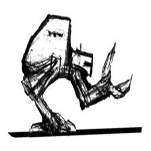

# A2C
**Automaton Chicken Crab**

## 📋 Glossary
 - automaton  
	A moving mechanical device that can perform some tasks without human intervention.
 - radio control  
	Allow device control from a distance by electromagnetic signals.

 - robot  
	Comes from a Czech word, robota, meaning "forced labor"  
	These machines are made to be slaves of humans.
 - android(male) or gynoid(female) are humanoid(droid)  
	Means: *inspired by the human form* (2arms,2legs, head roughly at the top and bipedal locomotion)
 - cyborg  
	Combination of synthetic and biological components.
 - bionics or bio  
	Inspired engineering, is the application of biological methods and systems found in nature to the study and design of engineering systems.
 - animatronics  
	Refers to the use of cable-pulled devices or motors to emulate a human or an animal, or bring lifelike characteristics to an otherwise inanimate object.
 - automata/automaton  
	Machines designed to automatically follow a predetermined sequence of operations.  
	Its often used to describe non-electronic moving machines, especially those that have been made to resemble human or animal actions, such as animated figures on a cuckoo clock. 
 - mechs mecha(メカ meka)  
	Refer to piloted from cockpit humanoid or non-humanoid robotic platforms,

## ℹ️ Description
Ambitious bipedal robot project  
*Bionical inspired (legs from chicken,arms from crabs) .*

## 📜 History
 - Origin:  
	Project created by [N-z0](https://github.com/N-z0) a long time ago. (In the 90s)
	
	I started this project around my 15 years old ,maybe one of my oldest.  
	So.. yeah,,,  it makes laugh to see that, because it's over ambitious .  
	But  compared to the today's kids,  i dont feel any shame... 😁
	
	I remember making plans and model with cardboards at my father's place.  
	And made a paw with metal parts bought in DIY stores,  
	Also realized a first very complete paw model on Autocad software, but lost unfortunately.
	
 - Development:  
	I recently (2019) wanted to edit this project,
	for also improve my objects design management.

